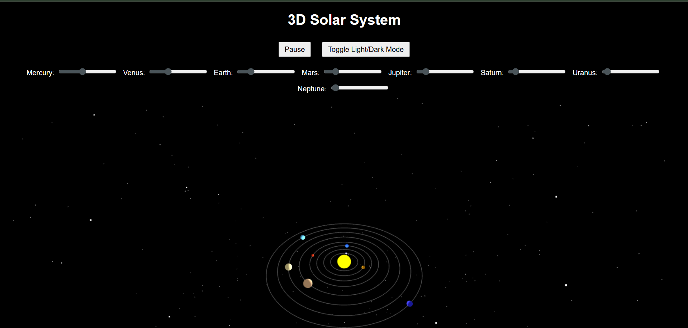
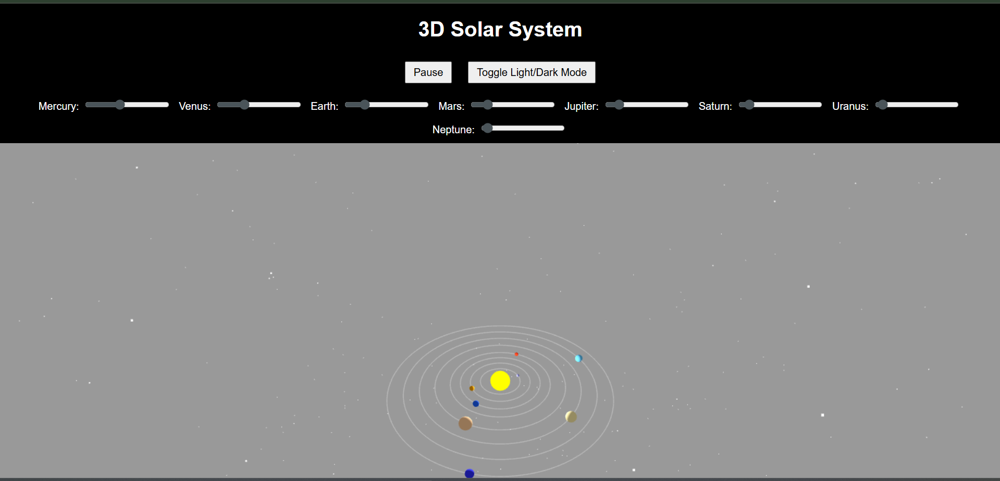
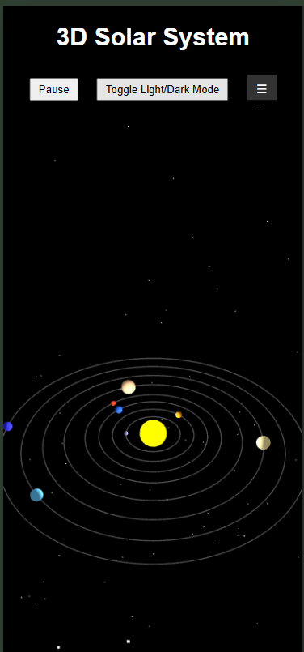

# 🌌 3D Solar System Visualization (Three.js)

This is an interactive 3D Solar System simulation built using [Three.js](https://threejs.org/). It displays planets orbiting the sun, with adjustable speeds, a light/dark theme toggle, and a mobile-friendly hamburger menu for controls.

---

🔗 **Live Demo**: [https://emcc2302.github.io/solar-system/](https://emcc2302.github.io/solar-system/)

---


## 🚀 Features

- Realistic orbits and spacing
- Hover tooltips for planet names
- Range sliders to control each planet’s speed
- Light/Dark mode toggle
- Responsive design with hamburger menu
- Click-to-zoom on planets

---

## 🧾 File Structure


📁 solar-system/

├── index.html # Main HTML file

├── style.css # Default styling

├── responsive.css # Responsive layout styles

├── script.js # Main Three.js logic

└── README.md # This file


##Screenshots

### 🌑 Dark Mode Desktop


### 🌕 Light Mode


### 📱 Mobile View



---

## 🛠️ How to Run It Locally

### 1. 📦 Prerequisites

No frameworks or builds needed. Just a browser and a modern OS.

> ✅ Recommended: Chrome, Firefox, Edge (latest versions)

---

### 2. 💻 Steps

#### Option 1: Run by double-clicking
1. Download or clone this repository.
2. Open `index.html` directly in your browser.

#### Option 2: Run via local server (for dynamic features)
```bash
# If you have Python installed:
# For Python 3
python -m http.server

# For Python 2
python -m SimpleHTTPServer
